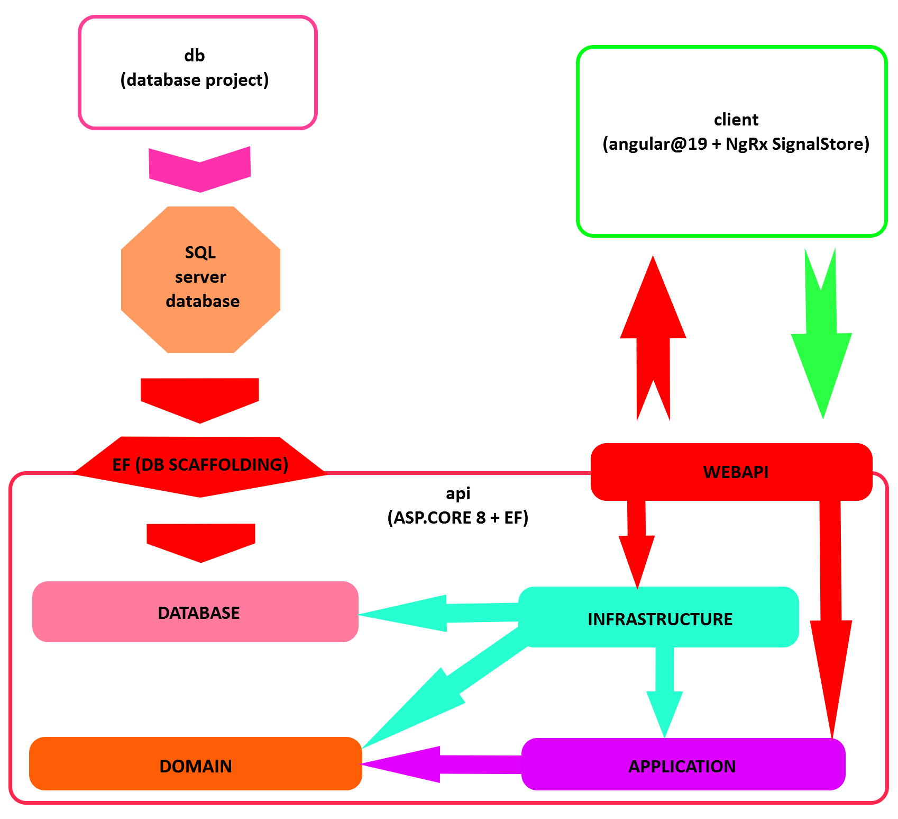

# life-roadmap
## 🏗️ Architecture Overview



### Layers description

- **Domain** – The core of the application. Contains business entities, value objects, and enums. Pure logic, no dependencies.

- **Database** – EF Core scaffolded entities and DbContext generated from SQL Server (Database-First approach). No logic.

- **Application** – Depends on Domain. Contains use cases, DTOs, and interfaces for services, repositories, etc. Pure logic, no infrastructure.

- **Infrastructure** – Depends on Application, Domain, and Database. Provides implementations for interfaces (e.g. repositories, services), and maps EF entities to Domain models or DTOs.

- **WebApi** – Depends on Application and Infrastructure. Handles HTTP requests, DI setup, middleware, and endpoints.

- **SQL Server Database** – Managed via Database Project. Tables, constraints, and changes are maintained and versioned here.

- **Client (Angular)** – Frontend SPA that communicates with WebApi via HTTP.

---

## 🚀 Getting Started

After cloning the repository, run the following commands to build and start the backend and frontend:

### Backend (.NET API)

```bash
cd api/LifeRoadmap.WebApi
dotnet restore
dotnet build

# Optional:
# Run the scaffold script to update EF Core models from the database.
# Make sure you have installed dotnet-ef as a global tool:
#   dotnet tool install --global dotnet-ef
dotnet msbuild -t:ScaffoldDb

dotnet run
```

### Frontend (Angular)

```bash
cd client
npm install
npm start
```


The backend will be available at https://localhost:5001,
and Angular frontend at http://localhost:4200.